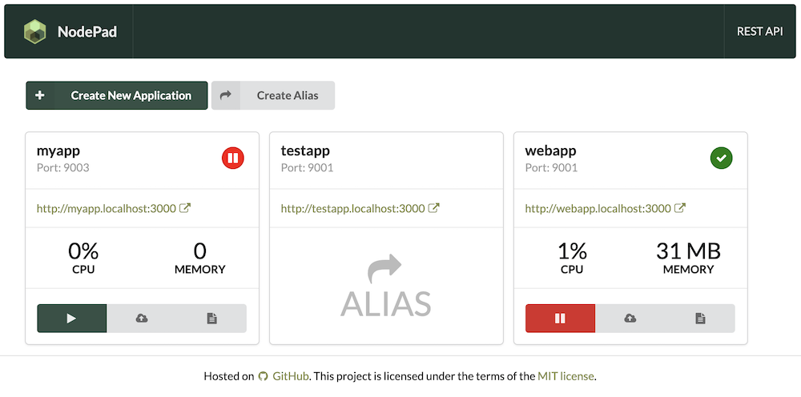

# NodePad
NodePad is a simple tool to manage your NodeJs apps. 

Main Features:
- [REST API](#rest-api)
- [Web User Interface](#web-user-interface)
- [Application Upload](#application-upload)
- Starting/stopping of node applications
- Preview logs
- [Routing](#routing)
- Authorization to NodePad API/UI
- Basic app monitoring

Under the hood, **NodePad** runs [PM2](https://www.npmjs.com/package/pm2) as a process manager.

# Installation

## Github

Clone Git Repository
```bash
git clone https://github.com/jamro/nodepad.git
cd nodepad
```

Install all node packages
```bash
npm install
```

Launch **NodePad**
```bash
npm start
```

Open **NodePad** in your Browser:
- User Interface: http://localhost:3333/
- REST API: http://localhost:3333/api

# Getting Started

## Create the app

- Open **NodePad** in your Browser (e.g. http://localhost:3333/). The port is configured in `config.js` under `appPort`.
- Click **Create New Application** and provide necessary details:
-- App ID: **helloworld**
-- App Port: **3335**
-- Click **Create** to add your new app
- **helloworld** app should be listed on the screen with status **off-line**
- Launch the app by clicking **Play** button. The status should change to **on-line**
- Go to your app URL: http://helloworld.localhost:3000/. The subdomain is the App ID provided before. The port is configured in `config.js` under `proxyPort`. It should return a default hello message from your app.

## Deploy the app

- Create app `index.js` source file anywhere on your disk:
  ```javascript
    #!/usr/bin/env node
    const http = require('http');

    const port = process?.env?.port;

    console.log('Starting application helloworld (port: ' + port + ')...');

    http.createServer(function (request, response) {
      console.log(`Request ${request.method} ${request.url}`);
      const content = '<h1>Hello World</h1>' + 
        '<p>This is a message from your new app. Congrats! It seems to work :)</p>';
      response.end(content, 'utf-8');
    }).listen(port);
  ```
- Compress `index.js` into `app.zip` file
- Open **NodePad** in your Browser (e.g. http://localhost:3333/).
- Click **Upload** next to **helloworld** app
- Choose `app.zip` and upload it.
- Go to your app URL: http://helloworld.localhost:3000/. It should return the new content

# Main Features

## REST API
All features are available through REST API. See http://localhost:3333/api for more details

## Web User Interface
The UI is available at http://localhost:3333/ and it could be an alternative to the [REST API](#rest-api)



## Application Upload
You can upload application bundles via [REST API](#rest-api) or [User Interface](#web-user-interface). The bundle is a ZIP file containing all application files. It has to contain `index.js` file that will act as a runner. After upload, NodePad will extract all files from the bundle, and will launch `/index.js` when starting the application.

## Routing
**NodePad** acts as a reverse proxy and route traffic to applications basing on domain names. It follows a pattern of `[appId].[rootDomain]`. For example, **NodePad** will redirect all requests to `webapp.example.com` to an application with ID `webapp`. Routing work for both: HTTP requests and WebSockets.

### Testing locally
To test routing locally, add proper entries to your `/etc/hosts`. For example
```
127.0.0.1 webapp.localhost
```

After that configuration, `webapp` application will be available at http://webapp.localhost:3000 (assuming that you run **NodePad** on default port 3000).

### Running NodePad behind a proxy
You can run **NodePad** behind a proxy. To make routing work, add `X-Forwarded-For` headers to requests on the proxy level. 

#### Sample Nginx configuration

```
events {
  worker_connections  1024;
}

http {
  server { 
    listen 80;
    server_name frontend;
    
    location / {
      proxy_http_version 1.1;
      proxy_pass http://localhost:3000;
      proxy_set_header Upgrade $http_upgrade;
      proxy_set_header Connection "Upgrade";
      proxy_set_header X-Forwarded-For $proxy_add_x_forwarded_for;
      proxy_set_header Host $http_host;
      proxy_cache_bypass $http_upgrade;
      proxy_redirect off;
    }
  }
}
```

### Sample HAProxy configuration

```
global
defaults
	timeout client          30s
	timeout server          30s
	timeout connect         30s

frontend frontend
	bind 0.0.0.0:80
  mode http
	default_backend backend

backend backend
	mode http
  option forwardfor
	server upstream localhost:3000

```